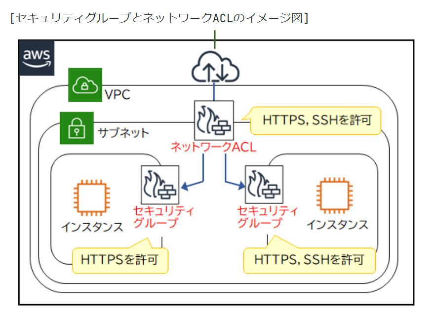
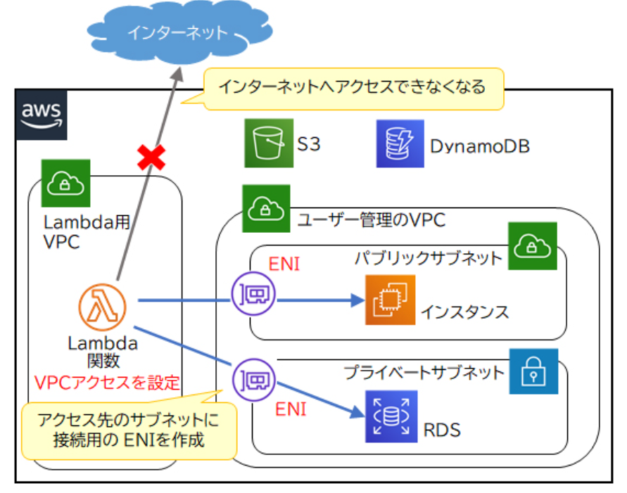
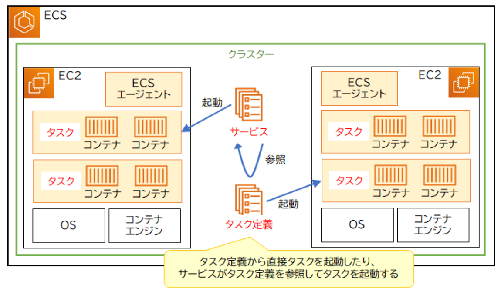
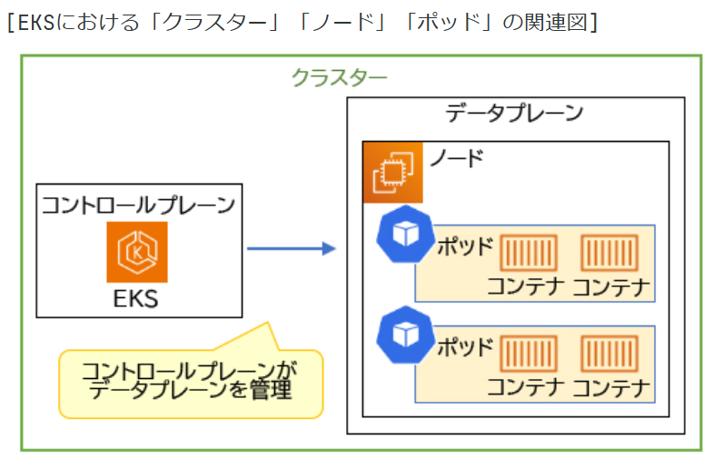

# 基本用語

## タイムアウト

処理やリクエストが**決められた時間内**に完了しなかった場合に、強制的に処理を中止すること

## プロビジョニング

ITリソースを準備し、利用可能な状態にするプロセスを指します。具体的には、ハードウェアの準備、ネットワーク、ソフトウェアのインストール。

## メトリクス

システムのパフォーマンスをリアルタイムで監視するために使用されます。例えば、CPU使用率、メモリ使用量、ディスクI/O、ネットワークトラフィックなどが一般的なメトリクスです。

## IOPS（Input/Output Operations Per Second）

ストレージデバイスの性能を評価するための指標で、1秒間に処理できる入出力操作の回数を示します。

## スループット

システムやネットワークが一定時間内に処理できるデータ量を示す指標です。通常、秒あたりのビット数（bps）、バイト数（Bps）、またはパケット数で表されます。IOPSは操作の回数

## ファイルサーバー

ネットワーク上でファイルを保存し、共有するための専用のサーバーです。

## Active Directory（

Microsoftが開発したディレクトリサービスで、ネットワーク上のリソース（ユーザー、コンピュータ、プリンター、ファイル共有など）を管理するためのシステムです。ユーザーアカウントやグループを作成し、ネットワークリソースへのアクセスを管理します。

## ストレージタイプ

| ストレージタイプ | 説明 | 具体例 | 主な用途 |
|------------------|------|--------|---------|
| **ファイルストレージ** | データをファイルやフォルダの単位で管理し、階層構造で整理するストレージ形式。 | NFS（Network File System）、SMB（Server Message Block） | ファイル共有、ドキュメント管理、メディアストレージ |
| **ブロックストレージ** | データを固定サイズのブロックに分割して管理するストレージ形式。 | Amazon EBS、SAN（Storage Area Network） | データベース、仮想マシンのディスク、トランザクション処理 |
| **仮想テープストレージ** | 物理テープの代替として、仮想テープライブラリを使用してデータを保存するストレージ形式。 | AWS Storage Gatewayのテープゲートウェイ | バックアップ、アーカイブ、災害復旧 |

## 可用性

システムやサービスがユーザーに対してどれだけ継続的に利用可能であるかを示す指標です。

# プロキシサーバー

## 定義
インターネットアクセスの「仲介役」となるサーバー

## 動作
ユーザー → プロキシサーバー → Webサイト

## 主な機能
- **キャッシュ**: サイト内容を一時保存し高速化
- **セキュリティ**: 不正アクセスの防止
- **匿名性**: ユーザー情報の秘匿
- **地域制限**: 異なる地域からのアクセス仲介

# ネットワーク

# VPC

- 「リージョン = 国や地域の単位」
  - 「AZ = その中のデータセンター単位」

## NAT
- NAT（Network Address Translation）は、ネットワークアドレス変換の略で、プライベートネットワーク内のIPアドレスを、外部のパブリックネットワーク（通常はインターネット）に接続する際に変換する技術です。NATインスタンスやNATゲートウェイを使用して、プライベートサブネット内のリソースがインターネットにアクセスできるようにしつつ、外部からの直接アクセスを防ぐことができます。

| 種類         | 説明                                                                 |
|--------------|----------------------------------------------------------------------|
| NATインスタンス | EC2インスタンスをNAT用に設定して、プライベートサブネットからインターネット通信を中継する方法。 |
| NATゲートウェイ | AWSが提供するフルマネージド型のNATサービス。                           |

### インターネットを経由せずにAWSサービスにアクセスするための手段

| 特徴               | VPCエンドポイント                          | AWS PrivateLink                        | VPCピアリング                          |
|--------------------|-------------------------------------------|----------------------------------------|----------------------------------------|
| 対象サービス       | 主にS3やDynamoDBなどの特定のAWSサービス   | AWSサービスおよびサードパーティサービス | VPC間の通信                           |
| 接続方法           | ゲートウェイエンドポイントまたはインターフェイスエンドポイント | インターフェイスエンドポイント         | VPC間の直接接続                       |
| 主な用途           | 特定のAWSサービスへのプライベートアクセス | 幅広いサービスへのプライベートアクセス | VPC間のプライベート通信               |
| セキュリティ       | インターネットを経由せずにアクセス可能     | インターネットを経由せずにアクセス可能 | インターネットを経由せずにアクセス可能 |
| サードパーティ対応 | 対応していない                             | 対応している                           | 対応していない                         |

- VPCピアリング
  - VPC同士を1対1で接続する機能です。同一アカウントのVPC同士や他のAWSアカウントのVPC、異なるリージョンのVPCでも、同一のプライベートネットワーク内に存在しているかのように相互に通信できます。

## ルートテーブル

ルートテーブルは、VPC内のサブネットから送信(受信ではない)されるトラフィックの経路を決定するためのものです。各エントリは、特定のIPアドレス範囲に対して、どのターゲット（例: インターネットゲートウェイ、NATゲートウェイ）を使用するかを指定します。

## セキュリティグループとネットワークACLの違い

| 特徴 | セキュリティグループ | ネットワークACL |
|------|---------------------|-----------------|
| レベル | インスタンスレベル | サブネットレベル |
| ステート | ステートフル（外部からのリクエストが許可されると、その応答も自動的に許可） | ステートレス（外部からのリクエストとその応答を個別に設定） |
| デフォルト設定 | 外部からのすべてのリクエストを拒否し、内部からの応答を許可 | 外部からのすべてのリクエストと応答を許可 |
| ルールの種類 | 許可のみ設定可能 | 許可と拒否の両方を設定可能 |
| 適用範囲 | 各インスタンスに個別に設定 | サブネット全体に適用 |

# ELB

## ALBのルーティングの種類と具体例

| ルーティングの種類 | 説明 | 具体例 |
|------------------|------|--------|
| **パスベースルーティング** | リクエストのURLパスに基づいてルーティングを行う。 | `/images/*`のパスを持つリクエストを画像サーバーにルーティング。例: `/images/photo.jpg` |
| **ホストベースルーティング** | リクエストのホストヘッダー（ドメイン名）に基づいてルーティングを行う。 | `example.com`へのリクエストをウェブサーバーに、`api.example.com`へのリクエストをAPIサーバーにルーティング。 |
| **HTTPヘッダールーティング** | 特定のHTTPヘッダーの値に基づいてルーティングを行う。 | `X-Environment: production`のヘッダーを持つリクエストを本番環境にルーティング。 |
| **クエリパラメータルーティング** | リクエストのクエリパラメータに基づいてルーティングを行う。 | `?version=beta`のクエリを持つリクエストをベータ版サーバーにルーティング。例: `https://example.com/app?version=beta` |
| **メソッドベースルーティング** | HTTPメソッド（GET, POST, PUTなど）に基づいてルーティングを行う。 | `POST`メソッドのリクエストをデータ処理サーバーにルーティング。 |

# Amazon EC2（Amazon Elastic Compute Cloud）

AWS上で動作する仮想サーバーを提供するサービスです。Amazon EC2などのAWSサービスが提供する仮想サーバーのことを「インスタンス」といいます。

# EC2インスタンスの起動手順

## 1. Amazon マシンイメージ（AMI）の選択
- AMIとは、サーバーを起動するために必要なOSやアプリケーションなどが含まれているテンプレート

## 2. インスタンスタイプの選択

- 
インスタンス作成時に選択できるCPU、メモリ、ストレージ性能、ネットワークキャパシティーの組み合わせです。インスタンスタイプごとにインスタンスに割り当てるCPUコア数、メモリ容量、ストレージの種類、ネットワークキャパシティーが決まっているので、ユーザーはその中からニーズに合ったインスタンスタイプを選択してインスタンスを作成します。**自由に組み合わせ出来ない**

### インスタンスタイプの命名

t   3   .   large
│   │       │
│   │       └── インスタンスサイズ（nano, micro, small, medium, large, xlarge, 2xlarge など）
│   │
│   └────── 世代番号（数字が大きいほど新しい）
│
└────────── インスタンスファミリー（t, m, c, r, i, g など）

### インスタンスファミリー

特定の用途に最適化されたEC2インスタンスのグループです。

| ファミリー | 意味 | 主な用途 | 特徴 |
|----------|------|---------|------|
| T系 (t2, t3など) | Think 安い | - 開発環境 - 小規模Webサーバー | - 低コスト - バースト可能（一時的に高性能） |
| M系 (m5, m6など) | Medium | - 中規模データベース - バックエンド処理 | - バランスの取れた性能 - 汎用的な用途 |
| C系 (c5, c6など) | Compute | - 高性能計算 - バッチ処理 | - CPU性能重視 - 計算処理に最適 |
| R系 (r5, r6など) | Ram | - メモリ集中型アプリ - 大規模データベース | - 大容量メモリ - メモリ性能重視 |
| I系 (i3, i4など) | I/O | - データウェアハウス - 高速ストレージ必要 | - 高速ストレージ性能 - I/O処理に最適 |
| G系 (g4, g5など) | Graphics | - 機械学習 - 3D描画 | - GPU搭載 - グラフィック処理向け |

## 3. キーペアの設定
- SSHまたはRDPでインスタンスに接続するための認証情報
- オプション：
  - **既存のキーペアを選択**
  - **新しいキーペアを作成**
  - **キーペアなしで続行**（非推奨）

## 4. ネットワークの設定
- VPCとサブネットの選択
- セキュリティグループの設定：
  - インバウンドルール（外部からのアクセス制御）
  - アウトバウンドルール（外部への通信制御）
- パブリックIPの割り当て設定

## 5. ストレージの設定

EC2インスタンスのストレージには、Amazon EBSおよびインスタンスストアを利用します。

- Amazon EBS（Elastic Block Store）
EC2インスタンスに割り当てられるブロックストレージで、物理ハードディスクドライブと同じように利用できます。

- インスタンスストア
EC2インスタンスの内部ストレージとして利用できる揮発性の（インスタンス稼働中にだけ利用可能な）ブロックストレージです。ホストコンピュータに物理的に割り当てられたディスク上にあり、頻繁に変更されるデータの一時的な保存領域として一部のインスタンスタイプで使用できます。

## 6. 高度な設定

- プレイスメントグループの設定

| タイプ | 配置イメージ | 主な用途 | 特徴 |
|-------|------------|----------|------|
| クラスター | 【■■■】 | - 高性能コンピューティング - ビッグデータ処理 | - 同じ場所に密集して配置 - 超低レイテンシー - 単一AZ内のみ |
| スプレッド | 【■】【■】【■】 | - 重要なアプリケーション - データベース | - 物理的に分散配置 - 高可用性 - 最大7インスタンス/AZ |
| パーティション | 【■■】【■■】【■■】 | - 大規模分散アプリケーション - Hadoop、Cassandra | - グループ単位で分散 - パーティション間で分離 - パーティションごとに複数インスタンス |

| 種類 | 特徴 |
|------|------|
| **オンデマンドインスタンス** | - 必要な時に必要なだけ利用 - 事前予約不要 - 使った分だけ支払い |
| **リザーブドインスタンス** | - 1年または3年の長期予約 - 常時稼働が前提 - 大幅な割引あり |
| **スポットインスタンス** | - AWS側の空きリソースを利用 - 中断の可能性あり - 最も安価 |

| 説明 | 基本概念 | 同一アカウント内の共有 | ハードウェアの可視性 | インスタンス配置 | ライセンス持ち込み | コスト | 主な用途 |
|------|---------|-------------------|-------------------|-----------------|------------------|--------|----------|
| **専有インスタンス** | 他のAWSアカウントとハードウェアを共有しない | 可能 | なし | 自動 | 制限あり | 比較的安価 | 基本的な分離要件 |
| **専有ホスト** | 物理サーバー全体を専有 | 不可能 | あり（ソケット、コアなど） | 手動制御可能 | 完全サポート | より高価 | 厳格なライセンス管理、詳細な制御が必要な場合 |

# Auto Scaling

EC2インスタンスなどのAWSリソースを負荷状況や設定されたスケジュールに基づいて、自動的にスケールアウト（リソース増加）やスケールイン（リソース削減）を実施するサービスです。

## Auto Scalingグループ

スケーリング対象となるAWSリソースを管理するためのグループです。最小・最大・希望リソース数などのパラメータに基づいて、AWSリソースのスケーリング（スケールアウト/イン）を自動的に行います。Auto ScalingのヘルスチェックによりAuto Scalingグループ内の正常なリソース数が必要なリソース数より下回った場合や、AWSリソースの負荷状況に応じて自動的に新しいリソースが起動されます。**複数のインスタンスを単一AZで起動する**

# S3

## S3のアクセス制御の種類まとめ

| 方法 | 制御単位 | 特徴 | 主な用途 | AWSアカウントへの制限 |
|------|----------|------|---------|----------------------|
| **S3バケットポリシー** | **バケット単位** | IPアドレスやドメイン単位でのアクセス制御、自AWSアカウントの制御 | **バケットごとのアクセス管理** | 可能 |
| **IAMポリシー** | **IAMユーザー・ロール** | AWSリソース全体で適用可能 | **AWSアカウント内のアクセス制御** | 間接的に可能 |
| **S3 ACL** | **オブジェクト単位** | 他AWSアカウント単位でアクセス権限を設定する読み取りまたは書き込みを許可できる機能です。アクセス元のIPアドレスやドメイン単位でのアクセス制御はできない | **特定のオブジェクトに特別な権限を設定** | 可能 |
| **Presigned URL** | **オブジェクト単位** | 一時的なアクセス許可 | **期限付きのダウンロード・アップロード** | 制限不可（生成者の権限に依存） |

## S3のストレージクラスまとめ

| ストレージクラス | 特徴 | 主な用途 |
|------------------|------|---------|
| **S3 Standard** | 高い耐久性と可用性 | 頻繁にアクセスされるデータ |
| **S3 Intelligent-Tiering** | アクセスパターンに基づいて自動的に階層を移動 | アクセスパターンが不明なデータ |
| **S3 Standard-IA** | 低頻度アクセス用、低コスト | 頻繁にはアクセスされないが、即時アクセスが必要なデータ |
| **S3 One Zone-IA** | 低頻度アクセス用、単一AZで低コスト | 再作成可能なデータ |
| **S3 Glacier Instant Retrieval** | アーカイブ用、即時アクセス可能、低コスト | 即時アクセスが必要なアーカイブデータ |
| **S3 Glacier Flexible Retrieval** | アーカイブ用、柔軟な取得オプション、低コスト | アーカイブデータで、数分から数時間の取得が可能 |
| **S3 Glacier Deep Archive** | 最も低コストのアーカイブ | 長期保存が必要なデータ |

## 署名付きURL

S3の署名付きURLは、非公開設定されたオブジェクトに対して有効期限のついたURLを発行することで、AWSアカウントを持っていないユーザーでも一時的にアクセスが可能になる機能です。署名付きURLはオブジェクトのダウンロードの他、アップロード用のURLも発行可能です。

# Lambda

1. 作成したLambda関数はLambda専用のセキュアなVPCに配置されます。このLambda専用のVPCからは、インターネットや、インターネットを経由してパブリックサブネット内のAWSリソースにはアクセスできますが、プライベートサブネット内のAWSリソースへはアクセスできません。
2. Lambda関数からプライベートサブネット内のAWSリソースへアクセスさせたい場合は「VPCアクセス」の設定をします。ENI（Elastic Network Interface）を作成して、プライベートサブネット内のAWSリソースへアクセスします。
VPCアクセスを設定したLambda関数は、ENIを作成しcたサブネットへアクセスできるようになる代わりに、インターネットへアクセスできなくなります。

# ECS

## Amazon ECSの主要コンポーネント

| コンポーネント     | 説明                                                                                     |
|------------------|----------------------------------------------------------------------------------------|
| **クラスター**     | コンテナを実行するための論理的なグループ。EC2インスタンスやFargateを使用してリソースを管理。 |
| **タスク定義**     | コンテナをどのように実行するかを定義するテンプレート。コンテナイメージ、CPU、メモリなどを指定。 |
| **タスク**         | タスク定義に基づいて実行されるコンテナのインスタンス。1つ以上のコンテナを含むことが可能。     |
| **サービス**       | 必要なタスク数を維持する機能です。あるタスクが異常終了して必要なタスク数を下回った場合、サービスが新しいタスクを起動して自動復旧します。サービスでは、起動するタスクのタスク定義、必要なタスク数、ELBとの連携などを設定します。タスクのスケーリングやロードバランシングを管理。   |
| **コンテナエージェント** | EC2インスタンス上で動作し、ECSクラスターと通信してタスクの実行を管理。   

## ECR（Elastic Container Registry）

コンテナイメージを登録・管理するサービスです。ECRに登録されたコンテナイメージをECSが参照し、コンテナ（タスク）を起動できます                  |

# Amazon EKS（Elastic Kubernetes Service）

## Kubernetesの基本コンポーネント

| コンポーネント | 説明                                                                                     |
|----------------|------------------------------------------------------------------------------------------|
| クラスター     | Kubernetesの基本単位で、コンテナ化されたアプリケーションを実行するためのノードの集合体です。クラスターは、マスター（コントロールプレーン）とワーカーノードで構成されます。 |
| ノード         | クラスター内の1つのマシン（物理または仮想）で、コンテナを実行するためのリソースを提供します。ノードには、Kubelet、コンテナランタイム、Kube-proxyなどのコンポーネントが含まれます。 |
| ポッド         | Kubernetesの最小デプロイメント単位で、1つ以上のコンテナを含むことができます。ポッド内のコンテナは、同じネットワーク名前空間を共有し、同じIPアドレスを持ちます。 |

ECSがAWS独自のコンテナオーケストレーションサービスであるのに対し、Amazon EKSはオープンソースのKubernetesをAWS上で運用するためのサービスです。

- Kubernetesは、コンテナ化されたアプリケーションのデプロイ、スケーリング、管理を自動化するためのオープンソースのコンテナオーケストレーションプラットフォームです。以下にEKSの主な特徴を説明します：

## Fargate

Amazon ECSやAmazon EKSでコンテナを実行するためのサーバーレスコンピューティングエンジンです。Fargateを使用すると、インフラストラクチャの管理を気にせずにコンテナを実行できます。必要なリソース（CPU、メモリ）を指定するだけで、Fargateが自動的にインフラストラクチャをプロビジョニングし、管理します。つまり、Dockerfileはコンテナの中身を定義し、Fargateはそのコンテナをどのように実行するかを管理する役割を果たします。

# ストレージ

## まとめ

| ストレージサービス | タイプ           | 主な用途 | 特徴 |
|-------------------|-----------------|---------|------|
| **Amazon S3**     | オブジェクトストレージ | バックアップ、アーカイブ、ビッグデータ分析 | 高い耐久性とスケーラビリティ、容量無制限、HTTP/HTTPSでアクセス可能 |
| **Amazon EBS**  Elastic Block Store  | EC2用のブロックストレージ   | EC2インスタンスのストレージ | 低レイテンシー、高いパフォーマンス、EC2にアタッチして使用 |
| **Amazon EFS** Elastic File Syste   | Linux向けNFSファイル共有   | 複数のEC2インスタンス間でのファイル共有 | NFSプロトコルを使用、スケーラブルで高可用性 |
| **Amazon FSx** File System extensible   | ファイルストレージ   | Windowsアプリケーション、HPC、ビッグデータ | Windowsネイティブ、SMBプロトコル、完全マネージド |

### SMBプロトコル (Server Message Block)

## OSI参照モデルの全体像
7. **アプリケーション層** ← SMBはここ
   - HTTP, FTP, SMB, SMTP

## 定義
Windowsで主に使用される**ファイル共有**のための通信プロトコル

## 主な用途
1. **ファイル共有**
   - 社内での文書共有
   - 共有フォルダへのアクセス

# Amazon EBS（Elastic Block Store）

インスタンスストアと同様に、EC2インスタンスの内部ストレージと同じように利用できるブロックストレージです。
EBSの記憶領域のことを「EBSボリューム」といい、EC2に割り当てることを「アタッチ」といいます。EC2インスタンスにアタッチされたEBSボリュームは、AWS内のネットワーク経由でEC2インスタンスと接続します。

## ブロックストレージ

記憶媒体を「ブロック」という固定長の単位で分割して管理するストレージのことです。

## EBSボリュームタイプ

| ボリュームタイプ       | 特徴                                                                 | 主な用途                                           |
|-----------------------|----------------------------------------------------------------------|---------------------------------------------------|
| **汎用SSD（gp3, gp2）** | バランスの取れたパフォーマンスとコストを提供。IOPSとスループットがスケーラブル。 | 一般的な用途、開発環境、テスト環境、ブートボリューム |
| **プロビジョンドIOPS SSD（io2, io1）** | 高いIOPSと低レイテンシーを提供。IOPSを指定してプロビジョニング可能。 | 高性能が求められるデータベースやミッションクリティカルなアプリケーション |
| **スループット最適化HDD（st1）** | 大容量でスループットが重視されるワークロード向け。コスト効率が高い。 | ビッグデータ、データウェアハウス、ログ処理         |
| **Cold HDD（sc1）**   | 最も低コストのHDDボリューム。スループットが低い。                   | アーカイブデータ、アクセス頻度の低いデータ         |
| **マグネティック（標準）** | 旧式のHDDボリューム。新しいワークロードには推奨されない。         | 低コストのバックアップやアーカイブ用途             |

## AWS Snow Family

オンプレミス上の大量のデータをAWSのストレージへ安全に転送するために、専用の物理デバイスを提供するサービスです。AWSから大容量ストレージを搭載したデバイスが貸し出され、ユーザーが移行対象のデータをデバイスへ取り込みます。

| デバイスタイプ         | 用途                           | 特徴                                                                 |
|----------------------|------------------------------|--------------------------------------------------------------------|
| **AWS Snowcone**     | 小規模なデータ転送、エッジコンピューティング | 小型でポータブル、約8TBのストレージ容量、エッジでのデータ収集や処理に適しています。 |
| **AWS Snowball**     | 大規模なデータ転送、エッジコンピューティング（データを生成するデバイスの近くでデータ処理を行います。） | 耐久性のあるデバイス、50TBまたは80TBのストレージ容量、エッジコンピューティング機能をサポート。 |
| **AWS Snowball Edge**| データ転送、エッジコンピューティング | ストレージ最適化モデル（最大80TB）とコンピューティング最適化モデル、強力なエッジでのデータ処理。 |
| **AWS Snowmobile**   | 大規模なデータセンターの移行       | 100PBまでのデータを物理的に移動可能なトレーラー、大規模なデータセンターの移行やバックアップに適しています。 |

## Amazon FSx
Amazon FSxはファイル共有に適したファイルストレージサービスです。ファイルストレージとはデータをファイルやフォルダの単位で階層構造として管理するストレージ形式のことをいいます。

| FSx バリエーション         | 主な用途 | 特徴 | 具体例 |
|---------------------------|---------|------|--------|
| **FSx for Windows File Server** | Windowsアプリケーション、ファイル共有 | Windowsネイティブ、SMBプロトコル、Active Directory統合 | 企業内のファイル共有、Windowsアプリケーションのデータストレージ |
| **FSx for Lustre**        | 高性能コンピューティング（HPC）、ビッグデータ分析 | 高スループット、低レイテンシー、POSIX互換 | 機械学習、メディア処理、金融モデリング |
| **FSx for NetApp ONTAP**  | エンタープライズアプリケーション、データ管理 | NetAppのONTAPデータ管理機能、NFS/SMB/iSCSIサポート | データベース、仮想デスクトップ、バックアップとリカバリ |

## Amazon EFS（Elastic File System）

EFS（Elastic File System）はNFS（※1）をサポートするファイルストレージサービスです。EFSは、主に複数のEC2インスタンスやオンプレミスからアクセスされるファイル共有ストレージとして利用されます。

## Storage Gateway
Storage GatewayそのものはAmazon S3やAmazon FSxなどのようなストレージサービスではありません。Gateway（規格の異なるネットワーク間を中継して接続する機器）の名が示す通り、オンプレミスとAWSストレージサービスとを橋渡しする役目を持つサービスです。NFS（Network File System）またはSMB（Server Message Block）を使用してAWSストレージへアクセスできるサービスです。

# DB

| サービス名          | タイプ               | 主な用途 | 特徴 | マルチAZ | オートスケーリング | リードレプリカ |
|--------------------|---------------------|---------|------|---------|-------------------|---------------|
| **Amazon RDS**     | リレーショナルデータベース | トランザクション処理、OLTP | Aurora,MySQL、PostgreSQL、Oracle、SQL Serverなどをサポート。自動バックアップ、スケーリング、異なるAZとリージョンに配置できる。 | 対応（2つのAZ） | ストレージのみ対応 | 対応 |
| **Amazon Redshift**| データウェアハウス     | ビッグデータ分析、OLAP | 高速なクエリ処理、ペタバイト規模のデータ分析。カラムナストレージを使用。 | 非対応（スナップショットはクロスリージョンに置ける） | 手動スケーリング | 非対応 |
| **Amazon DynamoDB**| NoSQLデータベース     | 高スループット、低レイテンシーのアプリケーション | フルマネージド、スケーラブル、キーと値のデータモデル。高速大容量に向いている | 対応(3つのAZ) | 対応 | グローバルテーブルで対応 |
| **Amazon ElastiCache** | インメモリデータストア | キャッシュ、リアルタイムデータ処理 | RedisまたはMemcachedをサポート。低レイテンシーでデータアクセスを高速化。 | Redis版のみ対応 | 非対応 | Redis版のみ対応 |

- フェイルオーバーは、システムの一部が障害を起こした際に、別のシステムやコンポーネントに自動的に切り替えるプロセスです。
- マルチAZ（(2)参照）を利用してRRを複数のAZに分散したり、異なるリージョンに配置することもできます。
- **RR（リードレプリカ）**という、参照専用のデータベースとして動作するレプリカ（複製）を作ることができます。データベースの参照時にかかる負荷が高い場合、RRを最大15台スケールアウト（処理台数の追加）し、参照時の負荷を分散できます。
- レプリケーションは、データを複数の場所にコピーして保持するプロセスです。

## RDS

- 暗号化
  - 暗号化を行う場合はデータベースの作成時に指定し、作成した後に暗号を有効化することはできません。暗号化を行うと、バックアップやスナップショット、ログ、RRへも暗号化が行われます。暗号化を解除する方法はありません

### RDSとDBエンジンの関係
- RDSの役割:
Amazon RDSは、データベースのインフラストラクチャ管理を簡素化するためのフルマネージドサービスです。データベースのセットアップ、パッチ適用、バックアップ、スケーリング、フェイルオーバーなどの管理タスクを自動化します。
- MySQLの役割:
MySQLは、RDS上で動作するデータベースエンジンの一つです。
RDSでMySQLを選択すると、MySQLのデータベース機能（クエリ、ストアドプロシージャ、トリガーなど）をそのまま使用できます。

### Amazon Aurora(RDSの一部)

- デフォルトで3つのAZに2つずつ（計6つ）のデータコピーが作成されます。
  - ストレージは互いに監視しあっており、データの破損が発生しても自動で検出、修復します。
- データベースインスタンスとストレージが分離したアーキテクチャ
  - データベースインスタンスは、データベースの計算リソース（CPU、メモリ）を提供します。
  - ストレージは、データを保存するための専用の分散ストレージシステムです。
- グローバルデータベース
  - 複数のリージョンにまたがって運用できるサービスです。
  - **プライマリーリージョン**: データの書き込みが行われる主要なリージョン。
  - **セカンダリーリージョン**: 読み取り専用のリージョンで、プライマリーからデータをレプリケート。
- Aurora Serverless(Redshiftにも似たようなのがある)
  - DBインスタンスの負荷状況に応じて、自動的にDBインスタンスの起動、停止、スケールアップ/スケールダウンを実施する機能

## Amazon DynamoDB(No SQL)

- オンデマンドモード ... 書き込み・読み込みのリクエスト単位で利用料金がかかる
- プロビジョニングモード ... 1秒間に行う書き込み・読み込みの量で利用料金が異なる

### DynamoDB Accelerator(DAX)
インメモリのキャッシュクラスタです。
DAXを利用することにより、ミリ秒（千分の一秒）だったレスポンスをマイクロ秒（百万分の一秒）レベルのパフォーマンスにまで向上させることができます。

### RCU（Read Capacity Unit）
RCUは、1秒間に1つの強力な整合性のある読み取り、または2つの最終的な整合性のある読み取りを処理する能力を表します。

### WCU（Write Capacity Unit）
WCUは、1秒間に1つの書き込み操作を処理する能力を表します。各書き込みは最大1KBのデータサイズを対象とします。

### ポイントインタイムリカバリ
データベースのバックアップとリカバリ機能の一つで、特定の時点にデータベースを復元することを可能にします。

### リザーブドキャパシティ
WCU、RCUともに100ユニット単位で予約購入する制度で、通常のプロビジョニングモードよりも割安に利用できます。

## Redshift(データウェアハウス)

### Amazon Redshiftのオプション比較

| オプション              | 主な特徴                                                                                   |
|------------------------|-------------------------------------------------------------------------------------------|
| **Redshift Spectrum**  | - S3上のデータを直接クエリ可能。 - データをRedshiftに移動せずに、S3の大規模データセットを分析。 - Redshiftのクエリ機能を活用して、S3とRedshiftのデータを統合的に処理。 |
| **Redshift ML**        | - Redshift内で機械学習モデルを構築・実行。 - SQLを使用して簡単にMLモデルを作成し、予測を実行。 - データサイエンスの専門知識がなくても、データ分析にMLを統合可能。 |
| **Redshift Serverless**| - サーバーレスでRedshiftを利用可能。 - インフラ管理不要で、需要に応じて自動スケーリング。 - 簡単なセットアップでデータウェアハウスを構築し、コスト効率を向上。 |

### AWS Systems Managerの主な機能

| 機能名               | 説明                                                                                   |
|---------------------|----------------------------------------------------------------------------------------|
| **パッチマネージャー**   | インスタンスへのOSパッチ適用を自動化し、セキュリティと更新管理を効率化。                           |
| **オートメーション**     | AWSリソースの管理タスクを自動化するワークフローを作成し、手動作業を削減。                       |
| **パラメータストア**     | 機密情報や設定データを安全に保存・管理し、アプリケーションの設定を一元管理。                     |
| **インベントリ**         | AWSリソースの構成情報を収集・管理し、インスタンスのソフトウェアや設定を可視化。                 |
| **セッションマネージャー** | EC2インスタンスへの安全なシェルアクセスを提供し、SSH/RDPを使用せずにアクセス可能。             |
| **ステートマネージャー**   | インスタンスの望ましい状態を定義・維持し、設定やソフトウェアを自動適用。                       |
| **アプリケーションマネージャー** | アプリケーションのリソースと依存関係を可視化・管理し、パフォーマンスと可用性を監視。         |
| **OpsCenter**        | 運用上の問題を一元管理し、解決策を提供。問題のトラッキングと分析を効率化。               |

## Amazon RDS Proxy

Amazon RDSおよびAmazon Auroraデータベースへの接続を効率的に管理するフルマネージドのプロキシサービスです。RDS Proxyをアプリケーションとデータベースの間に配置することで、データベース接続の管理を効率化し、アプリケーションのパフォーマンス、スケーラビリティ、および可用性を向上させることができます。特に、サーバーレスアーキテクチャやマイクロサービスアーキテクチャで使用されることが多く、頻繁なデータベース接続の確立や切断がパフォーマンスに影響を与えるケースに適しています。

# CloudWatch

大きく分けて３つの機能
- 「メトリクスの収集・監視」
  - 【EC2】CPU使用率、ディスクの読み取り・書き込み量
  - 【S3】バケットサイズ、ファイル（オブジェクト）数
  - 【ELB】リクエスト数、リクエストの応答時間
  - 【RDS】ストレージの空き容量、秒間の読み取り・書き込み操作の量
- 「アラームとアクション」
  - EC2インスタンスのCPU使用率が80%を超えた際に管理者宛にメール通知
  - インスタンス再起動、停止
- 「ログの収集・分析」
  - 例えば、CloudTrailにおけるAWSサービスの操作ログや、VPCフローログなどを収集することができます。

| サービス名                          | 説明                                                                                   |
|------------------------------------|----------------------------------------------------------------------------------------|
| **CloudWatch Logs**                | アプリケーションやシステムのログデータを収集、保存、分析する。                           |
| **Amazon CloudWatch Container Insights** | コンテナ化されたアプリケーションのパフォーマンスとリソース使用状況を監視し、可視化する。   |
| **CloudWatch Logs Insights**       | CloudWatch Logsに保存されたログデータをクエリし、分析するためのインタラクティブなツール。例えば「特定のアプリケーションが一定期間に出力した"Error"を含むメッセージをカウントする」のようなクエリを実行することができます |

# X-Ray

アプリケーションの動作に関するデータを収集・分析できるサービスです。主にトラブルシューティング目的で利用され、アプリケーション内のリクエストをトレースし、処理時間やレスポンスを分析することで、パフォーマンスのボトルネックやエラーの発生箇所を特定できます。
X-RayはCloudWatchの「X-Rayトレース」として利用できます。

# CloudTrail

AWSアカウント内で行われたすべてのAPIコールを記録することで、
アカウントのアクティビティを詳細に把握し、セキュリティとコンプライアンスの強化に役立てることができます。

1. ユーザーアクションの追跡:
2. リソースの変更履歴:
3. セキュリティインシデントの調査:
4. コンプライアンスの証跡:

# CloudFormation

EC2やELBなどのサーバー環境だけでなく、CloudWatchのような運用支援サービスも含め、
ほぼ全てのAWSリソースをコード化して、構築および運用を自動化できます。

- テンプレート
  - JSONまたはYAML形式で記述され、AWSリソースの構成や設定を定義する設計図の役割を果たします。
- スタック
  - リソース構成を定義したテンプレートをもとに環境を構築し、その環境を「スタック」という単位で管理します。
  - 例えば、Webアプリケーションをリリースする場合には、必要なAWSリソース（VPCやEC2インスタンスなど）をテンプレートに定義し、CloudFormationがプロビジョニング（構築）します。もしWebアプリケーションが不要になった場合は、スタックを削除することで関連するリソースをまとめて解除できるため、不要になった環境を簡単に削除できます。
- スタックセット
  - 複数のAWSアカウントで、または複数のリージョンでスタックを構築したい場合には「スタックセット（StackSets）」を利用します。

## Service Catalog
・CloudFormationテンプレートを製品として登録し、他のAWSユーザーへ共有できる

# AWS Elastic Beanstalk

アプリケーションが動作するための一般的な設定を提供し、開発者が簡単に環境を構築できるように**デプロイ**するためのサービスです。
EC2インスタンスは、OSはもちろん、Webサーバーソフトウェアやアプリケーションの実行環境などがインストール・設定された状態で提供されます。
単一インスタンス・複数インスタンス（Multi-AZ）の構成を選択でき、関連する各種AWSサービス（ELBやS3、Auto Scalingグループなど）も設定済みのため、開発者はアプリケーションをアップロードするだけでデプロイ（実行環境への展開）を行うことができます。

### AWS Trusted Advisor

AWS Trusted Advisorは、AWS環境の最適化を支援するオンラインツールで、コスト削減、パフォーマンス向上、セキュリティ強化、フォールトトレランスの向上を目的とした推奨事項を提供します。

#### 主要な機能とチェック内容

| 機能               | チェック対象リソース          | チェック内容                                                                 |
|--------------------|------------------------------|------------------------------------------------------------------------------|
| **コスト最適化**   | EC2、EBS、RDS                | 未使用または低利用のリソースを特定し、コスト削減の推奨を提供。                 |
| **パフォーマンス向上** | EC2、RDS、CloudFront        | リソースの設定を最適化し、パフォーマンスを向上させるための推奨を提供。         |
| **セキュリティ強化** | IAM、S3、セキュリティグループ | セキュリティのベストプラクティスに基づき、設定の見直しを推奨。                 |
| **フォールトトレランス** | RDS、Route 53、S3           | システムの可用性を向上させるための設定やバックアップの推奨を提供。             |
| **サービス制限**   | 各種AWSサービス              | サービスの使用制限に近づいている場合に警告を提供し、リソース管理を支援。       |

AWS Trusted Advisorは、運用の効率化とセキュリティの強化に貢献します。

# Amazon EventBridge
さまざまなソースからのイベントを受け取り、それを他のサービスに送るためのサービスです。簡単に言うと、イベントを受け取って、必要な場所に届ける「配達屋さん」のような役割を果たします。

- EC2インスタンスが起動状態（running）から停止状態（stopped）になったとき、再起動する
- 毎日決まった時刻にアプリケーションのログを収集・圧縮するLambda関数を呼び出す
- リソースの状態変化に応じてAPI呼び出しなどのアクションを実行できる

# AWS WAF（Web Application Firewall）

脆弱性を突いた外部からの攻撃や不正アクセス（クロスサイトスクリプティングやSQLインジェクションなど）から、Webアプリケーションを保護するサービスです。
Amazon CloudFront、Application Load Balancer、Amazon API Gatewayなどに割り当てて利用します。

# AWS Shield Advanced

EC2インスタンス、Elastic Load Balancing（ELB）、Amazon CloudFrontなどを標的としたDDoS攻撃に対して、高度な保護サービスを利用できます。

# AWS Step Functions

AWS Step Functionsは、複数のAWSサービスをワークフローとして連携させ、処理を自動化するためのフルマネージド型のサーバーレスサービスです。専用のGUI(Workflow Studio)を介して、視覚的にワークフローを作成することができ、AWS Lambda、Amazon S3、Amazon ECSなど、多くのサービスと連携することができます。

# AWS KMS（Key Management Service）

AWS KMSは、AWS上で暗号化キーを作成、管理、制御するためのフルマネージドサービスです。以下に主な機能と特徴をまとめます。

#### 主な機能

- **キーの作成と管理**:
  - 暗号化キー（CMK: Customer Master Key）を作成し、管理。
  - キーのライフサイクルを通じて、キーの有効期限やローテーションを管理。

- **アクセス制御**:
  - AWS IAMを使用して、キーへのアクセスを制御。
  - ポリシーを設定して、特定のユーザーやサービスに対するキーの使用を許可または拒否。

- **暗号化と復号化**:
  - データを暗号化および復号化するために、KMSキーを使用。
  - AWSサービス（例: S3、EBS、RDSなど）と統合して、データの暗号化を簡単に実装。

- **監査とコンプライアンス**:
  - AWS CloudTrailと統合して、キーの使用履歴を記録し、監査証跡を提供。
  - キーの使用状況を監視し、コンプライアンス要件を満たすためのデータを提供。
- 「エンベロープ暗号化（Envelope Encryption）」
  - KMSでは「KMSキー」「データキー」と呼ばれる2種類の鍵を使用してデータの暗号化および復号を行います。このように二段階で鍵を保護する方式を「エンベロープ暗号化（Envelope Encryption）」といいます。KMSでは、KMSキーとデータキーという2段階で鍵を管理することによってセキュリティの向上を図っています。

- 鍵の暗号・復号
  - サーバー
    - AWS（サービス提供側＝サーバー側）にデータが保存されるタイミングで暗号化が行われ、ユーザーがデータを取り出す際もサーバー側が復号して渡します。
  - クライアント側
    - サーバーへデータを送信する前にクライアント側で暗号化を行い、サーバー側では受け取ったデータをそのまま保存します。また、データの復号もクライアント側で行います。

# AWS Secrets Manager

データベースなどにアクセスする際のシークレット（ログイン時の認証情報など）を管理するサービスです。アプリケーションなどからAWSリソースへアクセスする際にSecrets Managerからシークレットを取得することにより、ログイン情報をアプリケーションにハードコーディングしたり平文で入力しておく必要がありません。また、シークレットは定期的に更新（ローテーション）されたりバージョン管理も行われます。

# Route 53

DNS（Domain Name System）とは「example.com」のようなドメイン名を「192.0.2.1」のようなIPアドレスに変換するシステムのことです。

## DNSにおける用語の比較

（`www.example.com`を例に）
| 用語               | 説明                                                                                   |
|--------------------|----------------------------------------------------------------------------------------|
| ドメイン名         | インターネット上で特定の場所を指し示すための名前。階層構造を持ち、ピリオドで区切られる。 | 例: `example.com`           |
| FQDN               | インターネット上で特定のホストを一意に識別するための完全なドメイン名。                  | 例: `www.example.com`       |
| 権威DNSサーバー    | 特定のドメインに関する公式なDNS情報を保持し、最終的な回答を提供するサーバー。             |
| キャッシュDNSサーバー | DNSクエリの結果を一時的に保存し、同じクエリに対して迅速に応答するサーバー。             |
| クエリ             | ドメイン名に関連する情報を取得するためのリクエスト。主にドメイン名をIPアドレスに変換するために使用。 |

## ルーティングポリシー

DNSクエリに対する応答を制御するための方法です。異なるルーティングポリシーを使用することで、トラフィックを特定の方法で分散させたり、特定の条件に基づいて応答を変えることができます。シンプルルーティングポリシー以外は、複数のルーティングポリシーを組み合わせることができます

| ルーティングポリシー | 説明 |
|----------------------------|----------------------------------------------------------------------------------------|
| シンプルルーティング | 単一のリソースに対する基本的なルーティング。最も一般的なルーティング方法。 |
| 加重ルーティング | 複数のリソースにトラフィックを分散。各リソースに対するトラフィックの割合を指定可能。 |
| レイテンシールーティング | ユーザーに最も低いレイテンシーを提供するリソースにトラフィックをルーティング。 |
| フェイルオーバールーティング | プライマリリソースが利用できない場合に、セカンダリリソースにトラフィックをルーティング。 |
| 地理的ルーティング | ユーザーの地理的位置に基づいてトラフィックをルーティング。 |
| 地理プロキシルーティング | ユーザーのIPアドレスに基づいて、指定された地理的な場所にトラフィックをルーティング。 |
| マルチバリュールーティング | 複数の健康なリソースのIPアドレスを返し、クライアントが選択できるようにする。 |
| 複数値回答ルーティング | 複数のリソースのIPアドレスを返し、クライアントが選択できるようにする。 |

### URLを入力してからサイトが表示されるまでの流れ

1. **URLの入力**
   - ユーザーがブラウザのアドレスバーにURL（例: `www.example.com`）を入力します。

2. **DNSクエリの発行**
   - ブラウザは、入力されたドメイン名に対応するIPアドレスを取得するためにDNSクエリを発行します。

3. **キャッシュの確認**
   - **ブラウザキャッシュ**: ブラウザはまず自身のキャッシュを確認します。
   - **キャッシュDNSサーバー**: 次に、ローカルのキャッシュDNSサーバー（通常はISPが提供）に問い合わせます。キャッシュに情報があれば、すぐにIPアドレスを返します。

4. **ルートDNSサーバーへの問い合わせ**
   - キャッシュに情報がない場合、クエリはルートDNSサーバーに送信されます。ルートDNSサーバーは、トップレベルドメイン（TLD）サーバーのアドレスを返します。

5. **TLDサーバーへの問い合わせ**
   - ルートDNSサーバーから得た情報を基に、TLDサーバー（example.comのサーバー）に問い合わせます。TLDサーバーは、該当するドメインのネームサーバーのアドレスを返します。

6. **ネームサーバーの選択**
   - ドメインの登録情報に基づいて、指定されたネームサーバー（この場合はRoute 53のネームサーバー）のアドレスが返されます。

7. **Route 53への問い合わせ**
   - クエリはRoute 53のネームサーバーに送信され、ドメイン名に対応するIPアドレスやその他のDNSレコードが返されます。

8. **IPアドレスの取得**
   - Route 53から取得したIPアドレスをブラウザに返します。このIPアドレスは、キャッシュDNSサーバーやブラウザにキャッシュされます。

9. **サーバーへの接続**
   - ブラウザは取得したIPアドレスを使って、ウェブサーバーに接続します。

10. **HTTPリクエストの送信**
    - ブラウザはウェブサーバーにHTTPリクエストを送信し、ウェブページのデータを要求します。

11. **ウェブページの表示**
    - ウェブサーバーから受け取ったデータをブラウザがレンダリングし、ユーザーにウェブページが表示されます。

# CloudFront

Amazon CloudFrontは、AWS上で動作する安全で高速なコンテンツ配信ネットワークです。CloudFrontを利用すると、世界各地に配置されているエッジロケーションから、自動的にクライアントと地理的な距離が近いエッジロケーションが選択されます。そしてエッジロケーション内のエッジサーバーがコンテンツを配信します。
ライブストリーミングやオンデマンドストリーミングなどの動的なコンテンツも高いパフォーマンスで配信できます。

## ディストリビューション

Amazon CloudFrontを使用するには、はじめに「ディストリビューション」を作成します。ディストリビューションではオリジンサーバーやキャッシュなど、コンテンツを配信するために必要な各種設定をします。

## 署名付きURL ※S3にも同様のがある

特定のユーザーに対して、特定の期間だけAmazon CloudFront経由でコンテンツにアクセスすることを許可するための方法です。

## OAI（Origin Access Identity）

CloudFrontディストリビューションがS3バケットにアクセスするための特別なユーザーです。OAIを使用することで、S3バケットへの直接アクセスを防ぎ、CloudFront経由でのみコンテンツを配信することができます。

# オンプレミスからAWSサービスへの接続

# AWS VPN

AWS VPNは、インターネットを介してAWSのVPC（Virtual Private Cloud）とオンプレミスのネットワークを暗号化されたトンネルで接続します。これにより、安全なデータ転送が可能になります。

## VPN

VPN（Virtual Private Network、仮想プライベートネットワーク）は、インターネットなどの公衆ネットワークを介して、プライベートネットワークを安全に拡張する技術です。以下にVPNの主な特徴と利点を説明します。

# AWS Direct Connect
オンプレミスなどのユーザー環境からAWSへ、専用回線を使ってセキュアに接続するサービスです。
専用回線を敷設する必要があり、設問の条件にある3日以内の利用開始が難しいので、

# AWS Global Accelerator

複数のリージョンで展開しているWebアプリケーションなどへのリージョン間の負荷分散が可能です。負荷分散先（エンドポイント）はALB、NLB、EC2インスタンス、Elastic IPアドレスを指定できます。

# Amazon Simple Notification Service（SNS）
EメールやSMS、Lambda関数、Amazon SQSを通して、複数のアプリケーションやユーザーに対して同時にメッセージを配信します。Amazon SNSはプッシュ型なので、サブスクライバー（購読者）の状態に関わらずメッセージを配信します。

※　ポーリング昨日はない

# Amazon Simple Queue Service SQS

フルマネージドのメッセージキューイングサービスです。「メッセージキューイング」とは個々のサービスやシステムをメッセージを使用して連携する仕組みのことで、サービス同士の橋渡しを担います。Amazon SQSはプル型なので、受信側の都合の良いタイミングでSQSへポーリング（問い合わせ）を行って、メッセージを受け取ります。

## 遅延キュー・メッセージタイマー

「遅延キュー（Delay Queue）」または「メッセージタイマー（Message Timer）」は、メッセージの送信者が送信したメッセージを指定時間経過後に受信させたい場合に使用します。

## ポーリング

機器などに対して、一定間隔で順番に問合せ（データの送信要求など）を行うこと

# ショートポーリング

メッセージがあった場合はメッセージを返し、メッセージがない場合でも即座に「空である」というレスポンスを返します。

# ロングポーリング
メッセージがあった場合はメッセージを返す点は同じですが、メッセージが空である場合は設定された時間（最大20秒）を待ちます。時間が経過してもメッセージを得られない場合は、「空」というレスポンスが返ります。
ショートポーリングの場合はSQSに対するAPIコールの数が増えやすく、コストが高くなる可能性があります。その場合、ロングポーリングを使用してAPIコール数を抑えることにより、コストを削減できる可能性があります。

# Amazon Kinesis

## 概要
- ストリーミングデータ（常に発生し続けるデータ）を扱うサービス
- リアルタイムでデータを収集・処理・分析が可能

## 主な用途
| データ種類 | 例 |
|-----------|-----|
| アプリログ | ユーザー操作、エラー情報 |
| IoTデータ | センサー情報、稼働状況 |
| 金融データ | 株価、取引情報 |

## 特徴
- 大量のデータをリアルタイムで処理
- 他のAWSサービスと連携可能
- 自動でスケーリング

## Amazon Kinesisのサービス一覧

| サービス名 | 主な機能 | 用途例 |
|------------|----------|---------|
| **Kinesis Data Streams** | ストリーミングデータの収集 | - アプリケーションログの収集 - IoTデバイスからのデータ収集 - ソーシャルメディアのフィード |
| **Amazon Managed Service for Apache Flink** （旧 Kinesis Data Analytics） | ストリーミングデータの処理・分析・可視化 | - リアルタイムな異常検知 - ライブダッシュボード作成 - データのリアルタイム集計 |
| **Amazon Data Firehose** （旧 Kinesis Data Firehose） | ストリーミングデータの配信・保存 | - S3へのデータ保存 - RedshiftやElasticsearchへのデータ送信 - データの自動変換と配信 |
| **Kinesis Video Streams** | 動画ストリームの取り込みと処理 | - 監視カメラの映像処理 - ドローンからの映像収集 - リアルタイム画像認識 |

## データの流れ

1. Data Streamsでデータを収集
2. Apache Flinkで処理・分析
3. Firehoseで保存先に配信
4. Video Streamsは動画専用のパイプライン

データソース → [Data Streams] → [Managed Flink で分析] → [Firehose] → S3/Redshift
                                                              ↓
                                                        Athenaで分析

# AWS Glue

フルマネージドのサーバーレスETLサービスです。
Glue（糊）の名の示す通り、複数のデータソース（S3やDynamoDBなど）からデータを抽出し、変換・統合したデータをターゲット（Redshiftなど）へ格納するといった、データ分析における橋渡しの役割を担います。

## ETLの段階

| ETLの段階 | 説明 | 例 |
|-----------|------|-----|
| Extract（抽出） | 様々なソースからデータを取り出す | データベース、ログファイル、APIなど |
| Transform（変換） | データを必要な形に加工する | 形式変換、クリーニング、結合 |
| Load（ロード） | 処理したデータを目的の場所に保存する | データウェアハウス、分析ツールなど |

# Amazon Athena

Amazon Athenaの名前の由来は、ギリシャ神話の女神アテナ（Athena）
Amazon S3上のデータに対して標準SQLを実行できるデータ分析サービスです。サーバーレスですので、EC2インスタンスなどインフラ（実行環境）のセットアップや管理が不要です。
データ分析に利用できるサービスにはAmazon EMRやAmazon Redshiftなどがありますが、いずれもインスタンスやクラスターなどのインフラの管理が必要です。Athenaは、常にサーバーを起動しておく必要がなく、プロトタイプの検証や手早く分析をしたいようなケースに向いています。

# Amazon EMR（旧Amazon Elastic MapReduce）

ビッグデータの処理や分析を行うサービスです。ビッグデータを処理する既存のフレームワークであるHadoop（ハドゥープ）やSpark（スパーク）を用いています。
さらに、ビッグデータを分析し経営に役立てることを「BI：Business Intelligence」といい、代表的なBIツールにはMicrosoft ExcelやMicroStrategyなどがあります。Amazon EMRはこれらのツールにも対応しています。

| サービス名 | 主な機能 | 用途例 | 特徴 |
|------------|----------|---------|-------|
| **Amazon Textract** | ドキュメントからテキストや構造化データを抽出 | - 請求書や領収書からの情報抽出 - フォームデータの自動入力 - 文書のデジタル化 | - 表やフォームからの自動データ抽出 - 手書き文字にも対応 - 高精度なOCR機能 |
| **Amazon Translate** | テキストの自動翻訳 | - Webサイトの多言語化 - 国際ビジネス文書の翻訳 - アプリの自動翻訳 | - リアルタイム翻訳 - 多言語対応 - カスタム用語集の作成可能 |
| **Amazon Comprehend** | テキストからの意味や洞察の抽出 | - 感情分析 - キーフレーズ抽出 - エンティティ認識 | - 自然言語処理（NLP） - 多言語対応 - リアルタイム分析 |
| **Amazon Transcribe** | 音声をテキストに変換 | - 会議の議事録作成 - 動画の字幕生成 - コールセンター会話の文字起こし | - 複数話者の識別 - カスタム語彙対応 - リアルタイム文字起こし |

Comprehend　理解する
Transcribe　書き写す
Textractは「extract（抽出する）」と「text（テキスト）」を組み合わせた造語です。

| サービス名 | 主な機能 | 特徴 |
|------------|----------|-------|
| **AWS Budget** | 予算の設定と管理 | - コストと使用量の予算設定 - カスタムアラートの設定 - 予算超過の事前警告 |
| **AWS Trusted Advisor** | AWSベストプラクティスのチェック | - コスト最適化 - セキュリティ強化 - パフォーマンス改善 - フォールトトレランス向上 |
| **AWS Cost Explorer** | コストと使用状況の分析 | - 詳細なコスト分析 - 使用パターンの可視化 - コスト予測機能 |

# AWS Control Tower

AWS Control Towerは「管理塔」という意味で、複数のAWSアカウントを中央集権的に管理・監視するという機能を表現した名称です。ビルの最上階にある管制塔のように、組織全体のAWS環境を見渡して管理するイメージです。

## マルチアカウント環境の管理

たくさんのAWSアカウントを「まとめて」「同じルール」で「簡単に」管理できるようにする仕組みです。

# Amazon SageMaker

"Sage"（賢者）と"Maker"（作る人）を組み合わせたものと考えられます。
意味を分解すると：
Sage（賢者）: 深い知識や知恵を持つ人を指す
Maker（作る人）: 何かを生み出す・作る人を指す
つまり、「機械学習モデルを通じて賢い判断ができるシステムを作り出すためのサービス」という意味が込められていると解釈できます。

AWS DataSync
Amazon AppFlow

# EC2インスタンスの起動手順

## 1. Amazon マシンイメージ（AMI）の選択
- AMIとは、サーバーを起動するために必要なOSやアプリケーションなどが含まれているテンプレート
- 選択オプション：
  - **クイックスタートAMI**: AWSが提供する一般的なOS（Amazon Linux、Ubuntu、Windowsなど）
  - **マイAMI**: 自分で作成または購入したAMI
  - **AWS Marketplace**: サードパーティが提供するAMI
  - **コミュニティAMI**: コミュニティメンバーが共有するAMI

## 2. インスタンスタイプの選択
- インスタンスタイプは、CPUやメモリ、ストレージ、ネットワーク性能などのハードウェア構成を定義
- 主なファミリー：
  - **t系**: 汎用（バースト可能）
  - **m系**: 汎用
  - **c系**: コンピューティング最適化
  - **r系**: メモリ最適化
  - **i系**: ストレージ最適化
  - **g系**: GPU最適化

## 3. キーペアの設定
- SSHまたはRDPでインスタンスに接続するための認証情報
- オプション：
  - **既存のキーペアを選択**
  - **新しいキーペアを作成**
  - **キーペアなしで続行**（非推奨）

## 4. ネットワークの設定
- VPCとサブネットの選択
- セキュリティグループの設定：
  - インバウンドルール（外部からのアクセス制御）
  - アウトバウンドルール（外部への通信制御）
- パブリックIPの割り当て設定

## 5. ストレージの設定
- ルートボリューム：
  - サイズ
  - ボリュームタイプ（gp2, gp3, io1, io2など）
  - 削除時の動作
- 追加ボリューム：
  - EBSボリュームの追加
  - インスタンスストアの利用

## 6. 高度な設定
- IAMロールの設定
- ユーザーデータスクリプトの設定
- 終了保護の有効化
- モニタリングオプション：
  - 詳細モニタリング（CloudWatch）
  - システムログ
  - インスタンスメタデータ

// ... existing code ...